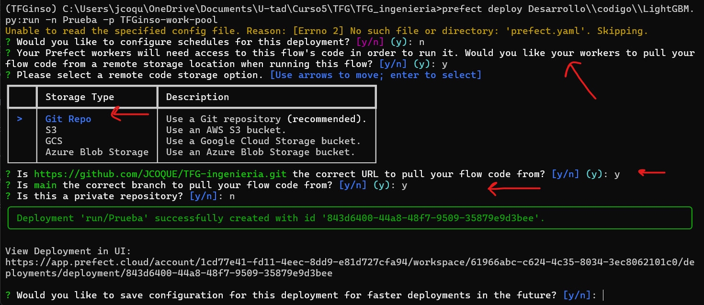

# Intro

In this README file, important information about the project will be described, such as links where the core information has been found, important aspects to keep in mind when modifying the code, and other things. All this will be organized by the tools used in the project, such as PowerBI, Azure, etc.

## Repository info
In this repository you will find:
- **Desarrollo**: This is where all the code and code-related things are store. Inside this folder we have
   - **codigo**: This is where all the code is saved. There are both: .py files and .ipynb files. The former are the files used in the project and for predictions. The latter have the most important .py info so that it can be understood in a more visual way what are they doing, since the .py might be a little bit long with all the Mlflow and Prefect code. Inside this folder, we also have:
        - **tfg_module**: I've created my own Python module to abstract some processes for the .py files. This way: code is reutilized and cleaner code is achieved.
        - **Informer2020**: This project uses the Informer algorithm. It is an open-source algorithm (not included in pytorch, nor any other ML framework) so to use it, you need to go [here](https://github.com/zhouhaoyi/Informer2020) and download it.
        - **pickle_models**: Folder where Informer and TCN models are temporary saved to be saved later to Mlflow. This is needed since they are not standard frameworks supported by mlflow.
        - **pred_plots**: Folder where predictions of each model (Informer, LightGBM, TCN and XGBoost) for each target (Ventas and Compras) and for each tracked metric (MAE and RMSE) are saved as a png (with the command plt.savefig()). These plots will be used to save them as artifacts in Mlflow along with their respective model.
        - **csv_predictions**: Folder where predictions of each model (Informer, LightGBM, TCN and XGBoost) for each target (Ventas and Compras) and for each tracked metric (MAE and RMSE) are saved as a .csv (with the command plt.to_csv()). These .csv will be used to save them as artifacts in Mlflow along with their respective model.
  - **datasets**: This folder contains the datasets used in this project. diario.csv is the one used in this project and it is stored in Azure Blob Storage (see the section below: Azure). Calendario and PGC are used in PowerBI.
  - **img**: Images used in this project's documentation in section 4. Desarrollo.
  - **SQL scripts**: (very basic) Commands used in SQL Server Management Studio.
  - **requirements.txt**: library requirements in this project.
    
- **dashboard**: This is where the dashboard, Zebra BI and PureViz (see PowerBI section below) figures and more is stored.
  
- **Memoria**: This folder contains the documentation for this project.
  - **Latex**: Contains .tex files for the documentation.
   - **imgs**: Contains images used in the documentations.
   - **documento.pdf**: Documentation of this project.
     
- **Teoria**: This folder contains most of the theory applied in this project.
  - **papers**: Most relevant papers separated by algorithms.
   - **Contabilidad**: Accounting info is saved in here.
## Tools
In this section, the software tools along with some information sources will be discussed.

### Mlflow
Mlflow is an MLOps tool that allows you to save a model, its parameters, metrics, and anything else related to the model (.csv, .png, etc.) when training. This allows you to track every model that has been trained and keep their information. This way, you can reuse the model whenever you want. It also allows you to compare different models based on the saved metrics. Mlflow has 'experiments'. Each experiment should save different trained models of an algorithm. In this project, since 4 algorithms were applied for two targets (Compras and Ventas), I have a total of 8 experiments.
- No specific source information was searched for this tool. Anything on the internet is helpful.

### Dagshub
In a nutshell, Dagshub is a GitHub for ML and data engineers. The main reason to use Dagshub in this project is to be able to deploy Mlflow in a non-local environment so that it simulates a real-case scenario better.
###### Related info sources for this project:
- Good Dagshub intro (not needed to know for this project): https://www.youtube.com/watch?v=SpBzOY-TIvg&t=306s&pp=ygUcZGFnc2h1YiBpbnRybyBkYXRhIHByb2Zlc3Nvcg%3D%3D
   - Data Professor: Introduction to DagsHub for Data Science
   
- Non-local Mlflow repository with Dagshub: https://www.youtube.com/watch?v=K9se7KQON5k&t=695s&pp=ygUTbWxmbG93IHdpdGggZGFnc2h1Yg%3D%3D
   - DSwithBappy: 02. Setting Up MLflow Experiments To a Remote Server | DagsHub | MLOps

### Prefect
For training automation, Prefect was used. Even though Python files can be executed automatically with cron jobs that every OS has, there is no way to track the execution. Prefect allows you to automate file execution, set input parameters for this file, and set some execution policies such as retries, maximum execution time to save computer resources, and much more. Additionally, unlike basic cron jobs you can decide where is the code you want to execute (for example, the code that I execute is on Github) and you can decide where that code get executed. This is perfect in case you have a laptot with GPU. It also provides a web interface where you can track the executions of your files, see if they failed, and understand why they failed. Additionally, it integrates with other software tools in case you are using them in your code. This way, you can save API keys, access tokens, and other security information in Prefect.
###### Related info sources for this project:
- Good Prefect intro: https://www.youtube.com/watch?v=D5DhwVNHWeU&t=1126s&pp=ygUHcHJlZmVjdA%3D%3D
   - Kahan Data Solutions: Getting Started with Prefect | Task Orchestration & Data Workflows
  
> Note: Airflow was also considered. You can use that software tool instead if preferred.

### Azure
Azure is a cloud computing platform and service created by Microsoft. 

#### Azure Blob Storage
In this project, Azure Blob Storage is used as a data lake for two things: storing raw .csv files used in this project and storing the transformed (added columns, predictions, and more) .csv files as .parquet files. This .parquet file is the one used in PowerBI for data visualization.

#### Data Factory
Data Factory (a.k.a ADF or Azure Data Factory) is another resource provided by Azure that allows you to create pipelines to move, transform, and process data between different sources. For this project, it was used to copy data from the .parquet file to an SQL Database.

#### Azure SQL Database
The Azure SQL Database is the source from which PowerBI retrieves data. The main reason to use the SQL Database as the PowerBI source is that it allows query folding for incremental refreshing in PowerBI (see PowerBI section).
> Note: The reason for using Azure Blob Storage and Azure SQL Database is to simulate a real-case scenario where the .csv files and the SQL Database are decoupled.
###### Related info sources for this project:
- Video 1: https://www.youtube.com/watch?v=xBJbvTAi5lY
     - Aleksi Partanen Tech: Get started with Azure Data Factory in 2024

- Video 2: https://www.youtube.com/watch?v=gc5mWkRPfWM
   - Aleksi Partanen Tech: Linked Service to Azure SQL DB Using Managed Identity
   
- Video 3: https://www.youtube.com/watch?v=07A3LPfiu18
   - Aleksi Partanen Tech: How to Copy a CSV File From Blob Storage To Azure SQL DB

- Video 4: https://www.youtube.com/watch?v=p78BJ3A-EvQ&t=1313s&pp=ygUPYWxla3NpIHRyaWdnZXJz
   - Aleksi Partanen Tech: How To Use Data Factory Triggers - Easy To Understand!

**Additionally**:
- How to perform UPSERT (i.e. Update + Insert) with Copy Data activity: https://www.youtube.com/watch?v=fegEN1Z1viM
   - TechBrothersIT: How to Perform UPSERT Insert/Update with Copy Activity in Azure Data Factory | ADF Tutorial 2022
- Datatype conversion: https://www.youtube.com/watch?v=vB446EB_-aU
   - Cloud Knowledge: Data Type Conversion in Copy Data Activity | Convert Data Types from Json Code | CSV to Azure SQL DB

### PowerBI
PowerBI is a data visualization tool. There is no specific reason to have chosen PowerBI over Tableau. [Zebra BI](https://zebrabi.com/pbi-pro-trial/?utm_term=zebra%20power%20bi&utm_campaign=Brand+campaign&utm_source=google&utm_medium=cpc&hsa_acc=5445927020&hsa_cam=10896260820&hsa_grp=108906923204&hsa_ad=634945809310&hsa_src=g&hsa_tgt=kwd-930008850410&hsa_kw=zebra%20power%20bi&hsa_mt=b&hsa_net=adwords&hsa_ver=3&gad_source=1&gclid=Cj0KCQjwpNuyBhCuARIsANJqL9ObqxkQ7e0maiaNObgA4knPiEXp2ruSty7l4JRZHvW-8eI3nH1wF6oaAignEALw_wcB) and [PureViz](https://pureviz.net/infographic) graphics were used.
###### Related info sources for this project:
- Incremental Refreshing: https://www.youtube.com/watch?v=Kui_1G6kQIQ
   - BI Gorilla: Configuring Incremental Refresh in Power BI
- PowerBI AI features: https://www.youtube.com/watch?v=5URcVnV29Is&list=PLa370_-deBCQOtfe2OpxuMJZ9C1RC0YJf
   - Solutions Abroad (not needed to know for this project): EVERY AI Feature you SHOULD KNOW in Power BI // Beginners Guide to Power BI in 2023

> Note: In the Incremental refresh video, pay special attention to minute 4:38.
### Git and GitHub
These popular version control systems (VCS) have been used throughout this project.

## Commands and other important info to keep in mind

#### Commnads
##### Git
- `git init`
- `git branch -M main`
- `git remote set-url origin <your_github_repository_url>`
- `git status`
- `git add .`
- `git commit -m '<commit_message>'`
- `git pull origin main`
- `git push origin main`

##### Prefect
- `prefect init cloud`  (you should have created a Prefect account previously)
   - After executing this command, you'll have two options:  log in using web browser or using API key. For the first time, use your web browser. Once you've done this, I encourage you to create an API key (Profile -> API keys) and log in with  this API key the next time. It will ask you to give a Time to live (TTL) to this API key. Choose the time you want.
   - Once you execute this command, you can start interacting with Prefect.
- Create a Work-pool: `prefect work-pool  --type <type_of_work_pool> <work_pool_name>`
- Create a deployment (be careful with this one. Read *Things to keep in mind* section below): `prefect deploy path/to/your/file/file.py:<function_name_with_flow_decorator> -n <deployment_name> -p <your_work_pool_name>`
- Finally, to execute the code you need a worker activated: `prefect worker start --pool <your_work_pool_name>` 

> Note: In the first command, the type of work pool used was `process`.
> Note: These commands are appropiate for a type `process` Work-pool. There are other types of Work-pools, and some of these commands might not be  correct.

#### Things to keep in mind
##### Creating a deploymen in Prefect
You can create a deployment in Prefect with a `.yaml`, with a `.py` with the command `.deploy` or via CLI like I explained in the previous section. Keep in mind that doing it via CLI, you'll be asked some question like: 
- do you want to set a schedule for this deployment?
- Is the function you provided to execute stored in Github (or other storage place).
- etc.
 

 
This is important to keep in mind because I did not expect any interaction when executing the `prefect deploy` command, and I did not know at first that you could set a `py` in Github to execute via CLI.

---

When using the `prefect deploy` command, it's crucial to understand how Prefect fetches and uses your code from a GitHub repository.
The prefect deploy command must be executed from the root directory of your GitHub repository on your local machine. This is necessary because Prefect will use this root path to correctly locate and fetch your code from the repository. 
In other words, before executing the `prefect deploy` command, navigate first to the root directory of the repository on your local machine with `cd /path/to/local/your_project_folder` 

--- 

Another thing to keep in mind is that at the moment, Prefect does not allow you -or at least not in a trivial way- to use ther decorators @task and @flow in class methods. They should be used in functions. That's why you'll find some *redundant* code in the .py.

--- 

Last but not least, are the paths where you store data. If your code, saves or retrieves data from a path on your local machine, use **absolute paths** always. That's why I created, inside `Desarrollo/codigo/tfg_module` a `.py` called `my_get_directories.py`. 
> Note: As I said before, this is in case you set the work pool the way I did.

 
 

That's pretty much everything. Hopefully things were explained decently ;).

